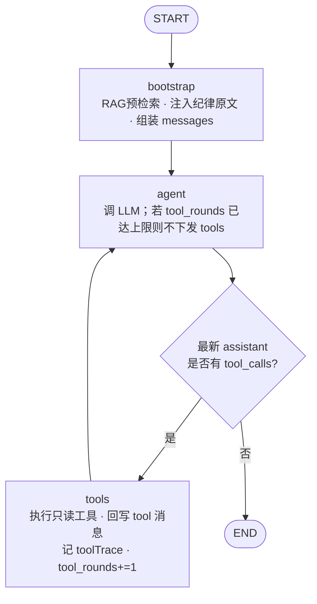
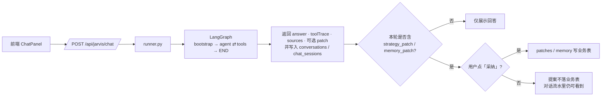

# 决策图说明与走查

> 对应代码目录：`backend/app/agents/graph/`  
> 系统分层与 RAG 总图：`docs/ARCHITECTURE.md`  
> 建议阅读顺序：`state.py` → `tools.py` → `graph.py` → `runner.py` → 本文

---

## 这张图在干什么

把「先查再答」固定成一条可循环流程：

```
START → bootstrap → agent ⇄ tools → END
```

| 节点 | 作用 |
|------|------|
| `bootstrap` | RAG：查询扩展 → 多路召回 → rerank，把纪律原文注入 messages |
| `agent` | 调大模型：要么点名工具，要么直接给结论 |
| `tools` | 执行只读工具，写回 messages，记录 toolTrace |
| `END` | 收束；由 `runner.py` 打包返回前端 |

**边界：**

- 工具全部只读（不写库）
- `tool_rounds` 达到上限（默认 4）后不再下发 tools，强制收束
- 写入只能靠回答里的 `strategy_patch` / `memory_patch` + 前端 HITL 确认

---

## 例子：用户问「sz300408 还能持有吗？」

### 0）入口

```
前端对话
  → POST /api/jarvis/chat
  → ask_jarvis()                 # agents/chat.py
  → run_decision_graph()         # agents/graph/runner.py
  → graph.ainvoke(...)           # 启动整张图
```

### 1）bootstrap（RAG）

- 查询扩展：原问题 + 历史里的代码/名称 + 纪律关键词（持仓/主升/五灯等）
- 多路召回：BGE-M3 向量 + 关键词，RRF 融合
- 可选 rerank：`BAAI/bge-reranker-v2-m3`
- 把**纪律原文和沉淀**写进 user 消息，而不是只写「命中 N 条」
- 组装 `messages = [system, …历史…, user(问题+检索块+编排提示)]`
- `tool_trace` 先记一条 `rag_retrieve`

模型开场就能引用条文；缺行情/持仓时再点工具。

### 2）agent 第 1 次

模型觉得缺实时数据，返回 `tool_calls`，例如：

| 工具 | 参数 | 目的 |
|------|------|------|
| `get_quote` | `sz300408` | 现价、涨跌 |
| `get_score` | `sz300408` | 综合评分 |
| `get_analysis` | `sz300408` | 利空/备注/复核 |
| `search_knowledge` | `持仓 利空门禁` | 纪律条文 |

`route_after_agent` 看到有 `tool_calls` → 走向 **tools**。

### 3）tools

- 按名字调用 `tools.py` 里的真实函数（只读）
- 每条结果以 `role=tool` 追加进 `messages`
- `tool_trace` 记下：`get_quote → get_score → get_analysis → search_knowledge`
- `tool_rounds = 1`
- 边回到 **agent**

### 4）agent 第 2 次

- 已有工具结果，直接输出中文建议（持有 / 减仓 / 清仓 / 观察）
- 可能在文末附带 JSON 提案：
  - `strategy_patch`（改 analyses / journal 等）
  - `memory_patch`（对话沉淀）
- **没有** `tool_calls` → `route_after_agent` → **END**

### 5）runner 打包

返回给前端大致包括：

- `answer`：自然语言结论
- `toolTrace`：刚才调过哪些工具（界面显示「工具：…」）
- `sources` / `memoriesUsed`：引用与沉淀
- `patch` / `memoryPatch`：提案（需你点确认才落库）
- `orchestrator: "graph"`

同时写入 MySQL `conversations`（挂到 `chat_sessions`），方便事后复盘与左侧历史切换。

---

## 流程图（当前实现）

> 下图对应 `backend/app/agents/graph/graph.py` 当前代码，不是抽象愿景图。



图上真实边只有三条：`START→bootstrap→agent`、`agent→tools|END`、`tools→agent`。  
补充说明（都不是独立图节点）：

- **强制收束**：在 `agent` 内部——`tool_rounds` 达上限时不下发 `tools` 参数。
- **解析 patch**：也在 `agent` 内部——无 `tool_calls` 时从回答抽出 `strategy_patch` / `memory_patch` 写入 state，再走 END。



---

## 强制收束长什么样

若模型一直想再调工具：

1. 每跑完一轮 `tools`，`tool_rounds += 1`
2. 当 `tool_rounds >= JARVIS_GRAPH_MAX_TOOL_ROUNDS`（默认 4）
3. 下一次 `agent` **不再**把 `OPENAI_TOOLS` 传给模型
4. 模型只能输出文字结论 → 结束

配置见：

- `.env` / `.env.example`：`JARVIS_GRAPH_MAX_TOOL_ROUNDS`
- `backend/app/core/config.py`：`jarvis_graph_max_tool_rounds`

---

## 和代码文件的对应关系

| 概念 | 文件 |
|------|------|
| 对话入口 | `backend/app/agents/chat.py` |
| 状态字段含义 | `state.py` |
| 只读工具 + schema | `tools.py`（适配层，业务在 services） |
| 共用服务层 | `backend/app/services/` |
| 节点 / 路由 / 收束 | `graph.py` |
| API 调用与 toolTrace 返回 | `runner.py` |
| 前端展示工具链 | `frontend/src/components/ChatPanel.vue` |

---

## 自己动手验证

1. 打开前端对话，问：`现在持仓有哪些？` 或 `sz300408 还能持有吗？`
2. 看回复下方是否出现「工具：get_positions …」之类
3. 对照回复里的「工具：…」与库中 `conversations` 表的 `tool_trace_json`

若没有工具链：确认后端已重启、`LLM_API_KEY` 有效，并看后端日志。

---

最后更新时间：2026-08-06
